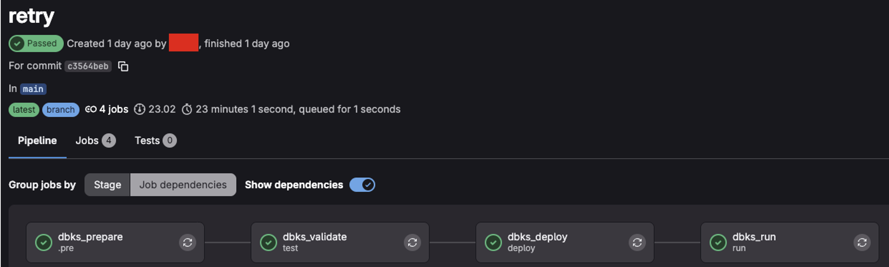
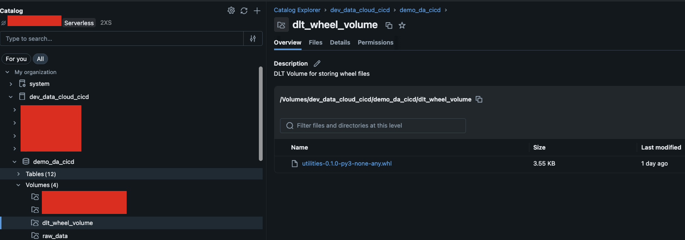
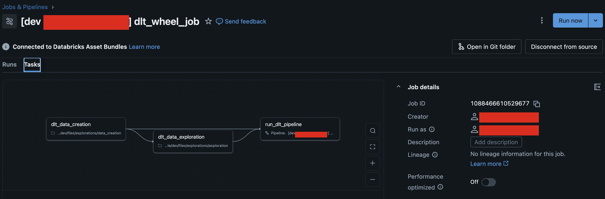
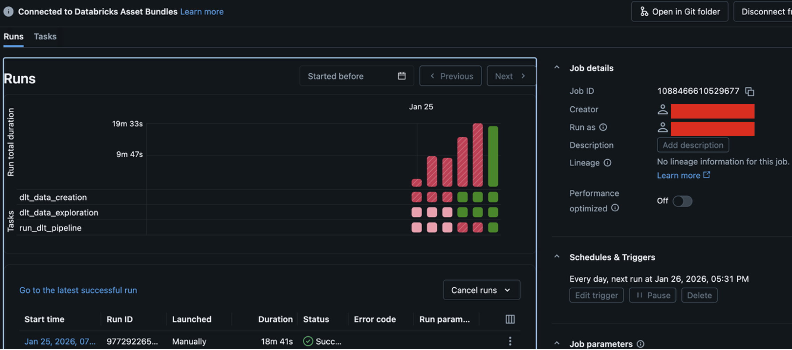

This project represents a modern, Enterprise-Grade approach to building data pipelines. 
By combining Delta Live Tables (DLT) with Databricks Asset Bundles (DABs) and Python Wheels, 
we achieve a level of modularity, testability, and automation that standard notebooks simply cannot match.


# 🚀 Enterprise DLT Framework: Modular Bundles & Python Wheels
## Why this project can be usefull
Most Databricks projects struggle with "Notebook Sprawl"—thousands of lines of code locked in UI-based notebooks that are hard to test and version. 
This project solves that by treating Data Engineering as Software Engineering.

### Key Benefits:
* 📦 Logic Portability: Core transformations are packaged as a Python Wheel (.whl). This means you can unit-test your business logic locally before it ever touches the cloud.

* 🏗️ Infrastructure as Code (IaC): Using Databricks Asset Bundles (DABs), we define our environment (Volumes, DLT Pipelines, and Jobs) in YAML. Deployments are consistent, repeatable, and human-error-free.

* 🛡️ Separation of Concerns: We split the architecture into foundation (Infra) and app (Logic). This allows platform teams to manage storage/volumes while data engineers focus on the pipeline.

* 🔄 Integrated CI/CD: A fully automated GitLab pipeline that builds the package, validates the bundle, deploys the infrastructure, and triggers the run—zero manual intervention required.


## 🏗️ Project Architecture
The project is structured to support a clean lifecycle from raw data creation to production-ready DLT tables:
```graph TD
    A[pyproject.toml] -->|build| B(Python Wheel)
    B --> C{GitLab CI/CD}
    C -->|deploy| D[Foundation Bundle]
    C -->|deploy| E[App Bundle]
    
    subgraph "Databricks Workspace"
        D -->|Creates| V1[(Wheel Volume)]
        D -->|Creates| V2[(Data Volume)]
        E -->|Uploads| B
        E -->|Triggers| J[Orchestration Job]
        J -->|Task 1| T1[Data Generation]
        J -->|Task 2| T2[DLT Pipeline]
        J -->|Task 3| T3[Data Exploration]
    end
```

## 📁 Repository Structure
* bundles/foundation/	: Defines the "Landing Zone" (UC Volumes for storage and library hosting).
* bundles/app/	: Defines the DLT Pipeline, the Orchestration Job, and the wheel upload logic.
* utilities/	: The "Brain" of the project. Contains the core Python source code for transformations. This will later become the wheel.
* transformations/	: DLT-specific scripts that call the functions stored in the Python Wheel.
* explorations/	: Scripts for generating mock raw data and performing post-run sanity checks.
* pyproject.toml	: Standard Python packaging configuration to build the .whl file.

## ⚙️ Automated Pipeline Lifecycle
Our gitlab-ci.yml ensures that no broken code ever reaches production:
 <p align="center">
  
 </p>

1. Build (.pre): Compiles the utilities/ folder into a versioned Python Wheel.

2. Test (test): Uses databricks bundle validate to catch YAML syntax errors or permission issues before deployment.

3. Deploy (deploy): Pushes the foundation (volumes) and the app (DLT/Jobs/Wheel) to Databricks.
  <p align="center">
      
      
  </p>

4. Run (run): Triggers the DLT pipeline automatically to ensure the end-to-end flow is functional.
  <p align="center">
      
      
  </p>

## 🔍 Code Review & Deep Dive
Note to the Reader: 
This section is reserved for a detailed walkthrough of the implementation. 
We will examine the configuration files and Python scripts one by one to understand how the Wheel packaging, and the DLT logic interact.

### 🏗️ The Foundation Layer: Infrastructure as Code
The Foundation Bundle acts as the "Landing Zone" for your project. 
By separating infrastructure from application logic, we ensure that storage locations and security policies are established before any data processing begins.

#### 📄 foundation/databricks.yml
This is the root configuration for the foundation layer. It tells Databricks how to behave during deployment.

1. bundle.name: Explicitly names the bundle for easy identification in the Databricks UI.

2. targets.dev:
 * mode: development: Automatically adds prefixes to resource names and handles cleanup. This prevents developers from accidentally overwriting production assets.
 * root_path: Uses dynamic variables (${workspace.current_user.userName}) to give every developer a private "sandbox" within the Workspace.

3. permissions: Implements Least Privilege. Only the current user is granted CAN_MANAGE access to these resources by default, ensuring a secure-by-design environment.

#### 📄 foundation/workflow.yml
This file defines the physical storage using Unity Catalog (UC) Volumes.Resource 
* dlt_wheel_volume : Acts as a private repository for your compiled Python Wheels (.whl).(location : dev_data_cloud_cicd.demo_da_cicd.)
* dlt_wheel_volumeraw_dlt_wheel_volume : The landing zone for raw data generated during the exploration/ingestion phase. (location : dev_data_cloud_cicd.demo_da_cicd.raw_data)

#### Why use Managed Volumes?
1. Governance: Access is controlled via Unity Catalog SQL permissions (e.g., GRANT READ VOLUME).

2. Organization: No more messy DBFS paths. Everything is structured under a Catalog and Schema.

3. Security: Managed volumes handle the underlying cloud storage (Azure Data Lake Storage Gen2) automatically, so you don't have to manage storage account keys manually in your code.

#### 💡 Insight: "Why this matters"
"By deploying the Foundation layer separately, we establish a contract. 
The data engineers know exactly where the raw data lives and where the code must be uploaded. 
This architecture allows a Platform Team to manage the 'Where' (Volumes) while the Data Team manages the 'How' (DLT logic)."


### 🏗️ The Application Layer: Logic, Orchestration & "The Bridge"
The Application Bundle is where the magic happens. 
It takes the infrastructure provided by the Foundation layer and the compiled code from your dist/ folder, 
and wires them into a production-ready data pipeline.

#### 📄 app/databricks.yml: The Bridge to the Cloud
This file defines how your local development artifacts are synchronized and deployed.

* sync.paths: This is critical. It tells Databricks to include the explorations and transformations folders (which live outside the app/ folder) in the deployment. 
This keeps your repository clean while ensuring the code is available in the workspace.

* The predeploy Hook (The Secret Sauce):
```
predeploy: "databricks fs cp ../../dist/${var.wheel_name} ..."
```
This experimental script is the "bridge." Before the bundle is fully deployed, 
it automatically grabs the Python Wheel built by your GitLab CI pipeline and uploads it to the Unity Catalog Volume created in the Foundation step. 
This ensures your latest logic is always available to the DLT engine.

* Dynamic Variables: By defining variables for the catalog, schema, and wheel_name, you make the project environment-agnostic. You can deploy to prod simply by changing a variable value.

#### 📄 app/workflow.yml: The DLT & Job Engine
This file contains the blueprint for your data processing and the job that orchestrates it.
1. The DLT Pipeline (dlt_wheel_pipeline)
This is a Serverless DLT configuration. It is highly optimized for performance and cost.
 * Wheel Dependency:
 ```YAML
 environment:
  dependencies:
    - /Volumes/${var.default_catalog}/${var.default_schema}/${var.wheel_volume}/${var.wheel_name}
 ```
This is the "Enterprise" way to handle code. Instead of bulky notebooks, the DLT pipeline imports your business logic directly from the uploaded Python Wheel.
* Source Code: It uses glob to include all transformation scripts, allowing for a modular folder structure.

2. The Orchestration Job (dlt_wheel_job)
The pipeline is wrapped in a 3-task Job to ensure end-to-end reliability:
 * dlt_data_creation (Notebook .py) : Generates raw landing data in the raw_data volume.
 * dlt_data_exploration (Notebook .py) : Performs sanity checks/EDA on the raw data.
 * run_dlt_pipeline (Pipeline resource on Databricks) : Triggers the actual Delta Live Tables logic using the Wheel.
 
##### Workflow Logic: 
The job uses depends_on to ensure the DLT pipeline only runs if the data creation and exploration steps are successful. 
This prevents "garbage in, garbage out" scenarios.

##### 💡 Insight: "Why this matters"
"With this setup, the client gets a fully automated lifecycle. 
A developer pushes code, the CI builds a Wheel, the Bundle uploads it, 
and the Job runs the full sequence. 
It’s the difference between 'It works on my machine' and 'It works in the Enterprise'."


#### 🧠 The "Brain": Python Packaging & Logic Abstraction
This final layer is where we separate Business Logic from Pipeline Orchestration. 
By packaging your core transformations into a Python Wheel while keeping the DLT decorators in the transformation scripts, 
you create a "Best of Both Worlds" scenario for your data team.

##### 📦 1. The Packaging Strategy (pyproject.toml)
We treat our helper functions like a professional software library. 
Using setuptools, the project compiles everything in the utilities/ folder into a .whl file.

* Standardization: Uses modern [project] metadata.

* Dependencies: Explicitly requires pyspark, ensuring the environment is correctly configured wherever the wheel is installed.

* Version Control: Versioning (e.g., 0.1.0) allows you to rollback logic or run different versions in different environments (Dev vs. Prod) without changing the code itself.


##### 🧪 2. Clean, Testable Logic (utilities/)
Take a look at utilities/bronze.py. It is Pure Python.
```Python
def load_raw_customers(path: str):
    return (
        spark.readStream
            .format("cloudFiles")
            ...
            .load(path)
    )
```
###### Why this is a win for Clients:

* Unit Testing: You can write tests for this function using pytest and a local Spark session. You don't need a live Databricks cluster to verify your logic.

* Reusability: This function can be used by DLT, but also by standard Databricks Workflows or even interactive notebooks.

##### 🎨 3. The Transparent UI (transformations/)
The transformation scripts act as the Entry Points. 
They are intentionally thin, serving as the bridge between the DLT engine and your packaged logic.

###### The Refactored CDC Flow: 
Instead of a 50-line notebook that is hard to read, we use a concise wrapper:

```Python
from utilities.bronze import load_raw_customers

dp.create_streaming_table("customers_cdc_bronze")

@dp.append_flow(target="customers_cdc_bronze")
def customers_bronze_ingest_flow():
    return load_raw_customers(PATH)
```
###### The Value Proposition:

* Visibility for Data Scientists: Data scientists can still open the transformations/ notebook in the Databricks UI to see the @dp decorators and understand the data lineage.

* Security for Engineers: The "Heavy Lifting" (the wheel) is a controlled, versioned artifact. This prevents accidental changes to core business logic while allowing the UI to remain descriptive.

##### 📖 Reference & Original Logic
The data processing logic implemented in the transformations/ and utilities/ 
folders is an adaptation of the official Databricks guide: [Tutorial: Build an ETL pipeline using change data capture.](https://docs.databricks.com/aws/en/ldp/tutorial-pipelines)

While the tutorial provides the foundational Spark and DLT code for handling Change Data Capture (CDC), this repository evolves that logic into a production-ready framework. We have decoupled the core Python functions into a versioned wheel and automated the infrastructure deployment via Bundles, demonstrating how to bridge the gap between a documentation example and an enterprise-grade deployment.


## 🏁 Getting Started: Deployment Commands
To deploy this entire stack to your development environment, follow these steps from your terminal:

1. Build the Wheel:
```Bash
python -m build
```

2. Deploy Foundation (Volumes):
```Bash
cd bundles/foundation
databricks bundle deploy --target dev
```

3. Deploy App (DLT, Jobs, and Wheel Upload):
```Bash
cd ../app
databricks bundle deploy --target dev
```

4. Run the Pipeline:
```Bash
databricks bundle run dlt_wheel_job --target dev
```
